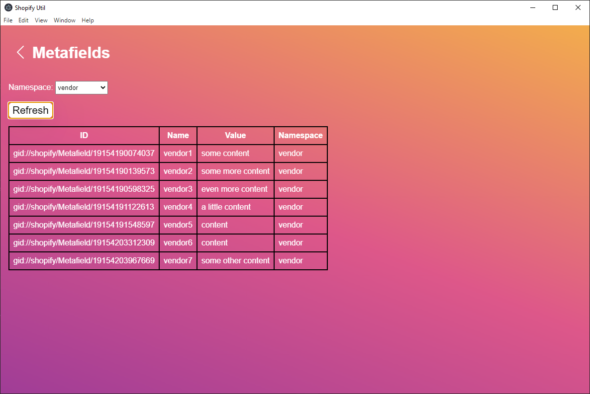

# Shopify Website Utility

## Purpose
The purpose of this project is to utilise the Shopify APIs to perform actions not available via the Shopify dashboard
and that don't require to be hosted 24/7. When working with Shopify, I noticed that metafields are not easy to access 
modify without the use of apps which often require a paid subscription. This is also a way for me to learn some new 
technologies and understand how Shopify works. If you are conscious of app developers having access to your store, customer
or order data, this is also a great way to keep everything local on your machine.

I will try to make features as generalised as possible so that it isn't tied to one particular store which I added 
features like the filter syncing shown below. If you have any suggestions of features you'd like to see, please get in
touch.

## App Walkthrough
### Landing Page

### Config Page
On the config page, you can put the credentials of a private app you have setup and also sync/scrape your store of all it's products and store metafields. The purpose of this
is to allow the drop down filters in the next pages to be autopopulated with all the options available. For the products, the current filters are **Vendor** and **Product Type**. For metafields, it's the **namespace**.

### Store Metafields
Shows a list of store metafields with pagination controls to view more records.

### Products
Shows a list of all store products. They can be filtered by Vendor or Product Type. Products can also be viewed in more detail by clicking the magnifying glass.

### Product Details
Shows the majority of fields available for a product via the API. This is a nice tool for building custom product pages

## Setting up a Private App
To use this application we need to get credentials to talk to the shopify store you wish to use.
1) Log into Shopify and go to the Admin Panel
2) In the left nav, go to `Apps`
3) At the bottom of the page, click `Manage private apps`
4) Navigate to `Create new private app`
5) Under `Admin API` select the permissions:
    - Product Read
6) Save the app
7) Copy over the `API key` and `Password` to the shopify config page

## Future Features
- Adding and modifying store metafields
- CSV file to upload store metafields
- CSV file to upload product metafields
- JSON support for metafields values  
- Better error handling for API calls

## Running from source code
WIP
